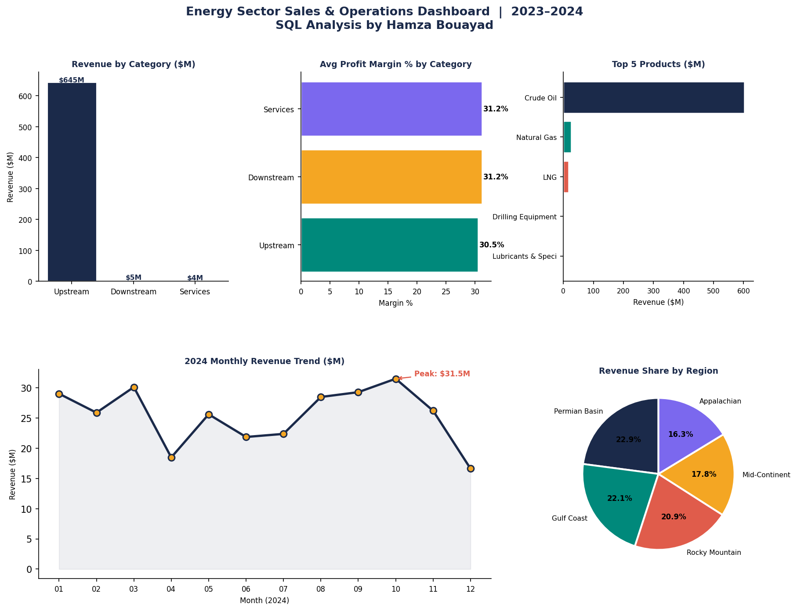

# Energy Sector Sales & Operations Analysis

**Tools:** Python · SQLite · Pandas · Matplotlib  
**Dataset:** Synthetic energy industry data — 1,800 transactions · 10 products · 5 US regions · 10 clients  
**Period:** 2023–2024

---

## Why I Built This

I kept reading about how energy companies in Houston and the Gulf Coast region are sitting on massive amounts of operational and sales data that never gets properly analyzed. Most of it lives in spreadsheets with no querying layer on top. I wanted to understand what it would actually look like to build a proper SQL database for an energy sales operation and run real business questions against it — so I built one from scratch.

---

## Business Questions I Answered

| # | Question | Method |
|---|----------|--------|
| 1 | Which product lines generate the most revenue? | GROUP BY + SUM |
| 2 | Which US regions are leading vs underperforming? | JOIN + aggregation |
| 3 | Which client types have the highest revenue per account? | Segmentation query |
| 4 | How does revenue trend month over month in 2024? | Time series aggregation |
| 5 | Where are the biggest profit margin opportunities? | Cost vs revenue comparison |

---

## Database Schema

```
products   → product_id, product_name, category, unit_cost
regions    → region_id, region_name, state
clients    → client_id, client_name, client_type, region_id
sales      → sale_id, product_id, client_id, region_id, sale_date, quantity, unit_price, discount
```

---

## Key Findings

**1. Regional Leader**  
Permian Basin (TX) leads all regions at $150M revenue with an average deal size of $382,540 per transaction.

**2. Client Segmentation**  
E&P Companies generate the highest total revenue ($191M), but Refineries lead in revenue per client at $77.5M each — making them the most valuable accounts to retain.

**3. Seasonality**  
Peak revenue month in 2024 was October at $31.5M. Q1 and Q3 consistently outperform — aligning with seasonal heating demand and summer driving patterns.

**4. Concentration Risk**  
Gulf Coast and Permian Basin together represent ~43% of total revenue — a geographic concentration worth monitoring as Mid-Continent and Rocky Mountain regions grow.

**5. Service Margin Opportunity**  
Pipeline inspection and compliance audit services carry significantly higher margins than commodity sales — suggesting upselling services alongside product deals is a strong profitability lever.

---

## Dashboard



---

## How to Run

```bash
pip install pandas matplotlib numpy
python energy_sales_analysis.py
```

No external dataset needed — the database is built and populated in-memory when you run the script.

---

## Skills Demonstrated

- Building a relational database schema from scratch (SQLite)
- Writing multi-table SQL queries (JOINs, GROUP BY, aggregations, subqueries)
- Data generation with realistic business logic and distributions
- Time series analysis and seasonality identification
- Client segmentation and revenue concentration analysis
- Dashboard design with Matplotlib (5 chart types)
- Translating query results into business recommendations
